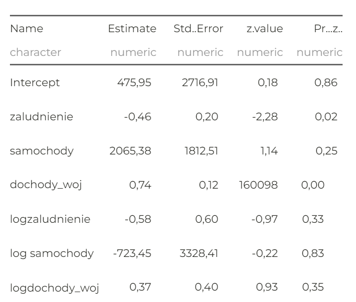
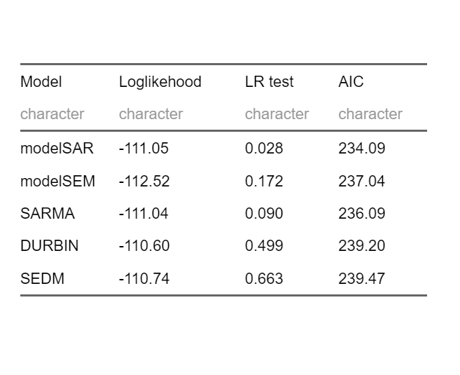

```{r setup, include=FALSE}
options(htmltools.dir.version = FALSE)

library(xaringanthemer)
library(xaringanExtra)
# style_duo_accent(
# primary_color = "#012169",     # Duke Navy Blue
# secondary_color = "#005587",   # Prussian Blue
style_mono_accent(
base_color = "#1c5253",
header_font_google = google_font("Josefin Sans"),
text_font_google = google_font("Montserrat", "250", "250i"),
code_font_google = google_font("Fira Mono")
)
```

## Wybór zjawiska i determinant
<small>
Celem projektu jest sprawdzenie czy długość dróg rowerowych rozkłada się przestrzennie, jeśli tak to dobrany zostanie model przestrzenny, który w najlepszy sposób wyjaśni to zjawisko. Zdecydowaliśmy się analizę dróg rowerowych, ponieważ jesteśmy fanami kolarstwa szosowego i czujemy potrzebę lepszego poznania rozkładu przestrzennego dróg, aby w przyszłości stworzyć atlas z poradami dla rowerzystów ekonomistów. <p>
Zmienne objaśniające, czyli te które mogą determinować długość dróg rowerowych w poszczególnych województwach:
--
<br>
- `zaludnienie` - Obszary o większej liczbie zaludnienia mają tendencje do posiadania lepszej infrastruktury dla rowerzystów
--
<br>
<br>
-   `samochody` - Jako ze samochody są droższe w utrzymaniu i nie każdego może stać na utrzymanie może to spowodować większą skłonność do podróżowania rowerem
--
<br>
<br>
-   `dochody województw` - Czym bogatsze województwo tym więcej może przeznaczyć środków na budowę ścieżek rowerowych 
</small>

---
## Mapa i dane statystyczne
.pull-left[
```{r, message=FALSE, warning=FALSE, include=FALSE}
# Biblioteki
library(sp)
library(spdep)
library(sf)
library(spatialreg)
library(ggspatial)
library(readxl)
library(tidyverse)
library(gridExtra)
library(ggmap)
library(geodist)
library(scales)
library(tmap)
library(whitestrap)
library(spatialreg)
library(lmtest)
library(tseries)
library(yaml)
library(knitr)
library(rmarkdown)
library(revealjs)
library(plotly)
library(papeR)
library(sjPlot)
library(sjmisc)
library(sjlabelled)
library(vtable)
library(xtable)
library(flextable)
library(stargazer)
library(png)
library(magick)
```


```{r, message=FALSE, warning=FALSE, results='hide', include=FALSE}
data <- read_excel("dane scalone.xlsx")
mapa <- st_read("PL_NUT2.shp")
```
<br>
**Prezentowane dane:**
<small>
- Dane pochodzą z Główego Urzędu Statystycznego.
- Badane zjawisko analizowane z podziałem na województwa. 
- Analiza przestrzenna dotyczy 2021 roku. 
</small>

<br>

**Stworzenie macierzy sąsiedztwa**
<small> 
- Do badania przestrzennej zależności długości tras rowerowych w poszczególnych województwach, wykorzystana zostanie macierz sąsiedztwa: `królowa I rzędu` </small>
]

.pull-right[
```{r, warning=FALSE, message=FALSE, results='hide', include=FALSE}
#Stworzenie macierzy sąsiedzwa- królowa I rzędu
queen1 <- poly2nb(mapa, queen = TRUE)
Wqueen1 <- nb2listw(queen1)
wm1 <- nb2mat(queen1, style='B')
wm2 <- nb2mat(queen1, style='W')
```

```{r, warning=FALSE, message=FALSE, results='hide', include=FALSE}
## Łączenie danych z obiektami przestrzennymi```{r, message=FALSE, warning=FALSE, results='hide'}
dist1 <- as.matrix(dist(coords))
print(dist1)
```

```{r, message=FALSE, warning=FALSE, results='hide', include=FALSE}
spatial.data <- sp::merge(y = data, x = mapa, by = "JPT_KOD_JE")
spatial.data  <- spatial.data[,c(5,38,39,40,41,42,43,44,45)]
names(spatial.data)[names(spatial.data) == "JPT_NAZWA_"] <- "wojewodztwo"

```
<br>
<br>
```{r, warning=FALSE, message=FALSE, fig.height=8, fig.width=8, echo = FALSE, fig.align = 'center'}
coords <- coordinates(as(mapa, "Spatial"))
plot(st_geometry(mapa), border="black")
plot(queen1, coords, add=TRUE)
```
]
---
## Wizualizacja badanego zjawiska

```{r, message=FALSE, warning=FALSE, results='hide', include=FALSE}
base.plt <- ggplot(st_as_sf(spatial.data), lwd = 0.001) +
  theme_void() +
  scale_fill_fermenter(NULL, n.breaks = 10, palette = "Dark2")

przewoz.plt <- base.plt +
  geom_sf(aes(fill = drogi_rowerowe), color="grey20") +
    geom_sf_label(aes(label = wojewodztwo), size=3, fill = "#ebebeb", alpha = 0.8)+
  #geom_sf_text(aes(label = wojewodztwo), size=3, family="sans", colour = "#DCEAF4")+
  scale_fill_gradientn(NULL,
          colors = c(rgb(255, 255, 255, maxColorValue = 255),
                     rgb(80, 145, 119, maxColorValue = 500),
                      rgb(45, 77, 66, maxColorValue = 400)), 
          trans = 'sqrt') +
  ggtitle("Długość tras rowerowych w poszczególnych województwach")+
  theme(
  plot.title = element_text(color="black", size=16))
    
```

```{r, message=FALSE, warning=FALSE, echo = FALSE, fig.align = "center", fig.height=5, fig.width=10}
przewoz.plt
```
<br>

<small> 
**Wnioski:**
Najwięcej kilometrów dróg rowerowych jest w województwie mazowieckim. Drugie miejsce zajmuje województwo wielkopolskie, trzecie- pomorskie. Najmniej kilometrów dróg rowerowych jest w województwie świętokrzyskim. </small>
---

```{r xaringan-panelset, echo=FALSE}
xaringanExtra::use_panelset()
xaringanExtra::use_fit_screen()

```

### Badanie zależności przestrzennych
.panelset[
.panel[.panel-name[Hipoteza]

<br>

<small> 
**Test Morana**- sprawdzamy czy istnieją zależności przestrzenne i czy są one istotne oraz czy istnieje związek między składnikiem losowym modelu, a resztami z opóźnienia przestrzennego. </small>

<br>
<small>
**Hipoteza:** </p>
H0: Brak zależności przestrzennych <p>
HA: Istnieją zależności przestrzenne
</small>
]

.panel[.panel-name[Test Morana]
<br>
<br>
<br>

```{r include=FALSE}
#stworzenie modelu
model = drogi_rowerowe ~ zaludnienie + samochody + dochody_woj
OLS = lm(model, data=spatial.data)
summary(OLS)
```

```{r echo=FALSE}
res = residuals(OLS)
m <- lm.morantest(OLS, listw=Wqueen1) 
m <- as_flextable(m, digits=4)
m <- set_header_labels(m, estimate1="Moran I statistic", estimate2="Expectation" , estimate3="Variance", statistic="Standard deviate")
m
```

]

.panel[.panel-name[Wizualizacja testu Morana]
```{r, message=FALSE, warning=FALSE, echo=FALSE, fig.align = "center", fig.height=6, fig.width=6}
moran.plot(res, listw=Wqueen1) 
```
]

.panel[.panel-name[Wnioski]
<br>
<br>
<small>
**Wnioski:**

p-value < ⍺ (na poziomie istotności 0.05), należy zatem odrzucić H0 na korzyść HA, oznacza, to że model jest przestrzenny.

Graficzną prezentacją autokorelacji przestrzennej jest wykres rozrzutu Morana. Największe skupienia występują w III i I ćwiartce, co wskazuje na podobnych sąsiadów. Obiekty o niskich wartościach otaczane są o niskich wartościach, zaś obiekty o wysokich wartościach są otaczane przez obiekty o wysokich wartościach.

Kierunek linii regresji jest >0 (dodatnia korelacja), co oznacza, występowanie klastrów o podobnych wartościach.
</small>
]
]
---
class: center, middle

## Budowa modelu

Szukanie modelu, który najlepiej wyjaśni badane zjawisko

---
### Model OLS
.panelset[
.panel[.panel-name[Opis modelu]

<br>
<br>
<br>
<small>
**Regresja metodą najmniejszych kwadratów** (**OLS**) jest powszechną techniką szacowania współczynników równań regresji liniowej, które opisują związek pomiędzy jedną lub większą liczbą niezależnych zmiennych ilościowych, a zmienną zależną (prosta lub wielokrotna regresja liniowa).
</small>
]
.panel[.panel-name[Parametry modelu]
.pull-left[
<small>
<small>
```{r echo=FALSE, fig.dim=c(4,4), warning=FALSE, out.width="30%", size="tiny"}
model = drogi_rowerowe ~ zaludnienie + samochody + dochody_woj
OLS = lm(model, data=spatial.data)
#summary(OLS)
tab_model(summary(OLS))
pvalue <- pf(summary(OLS)$fstatistic[1], summary(OLS)$fstatistic[2], summary(OLS)$fstatistic[3], lower.tail = FALSE)

as_flextable(as_data_frame(pvalue),digits=5)
```
</small>
</small>
]

.pull-right[
<br>
<br>
<small>
<small>
**Wnioski:**
Zmienna, które okazały się istotne, dla modelu OLS to: `dochody województwa` <p>
 
Zmienne: `zaludnienie` i `samochody` są nieistotne, jednak test Morana wskazuje na zależności przestrzenne, a więc pozostałe zmienne nie zostały usunięte z modelu, dodatkowo taki dobór zapewnia wysoki poziom dopasowania modelu (R-kwadrat równy 0,764)
</small>
</small>
]
]
.panel[.panel-name[Test Morana dla modelu OLS]
```{r message=FALSE, warning=FALSE, include=FALSE}
lm.LMtests(OLS, listw=Wqueen1, test="all")
```
<small>
<small>


<br>
<br>

</small>
</small>
]
]
---
### Testowanie modelu OLS 
.panelset[

.panel[.panel-name[Test Morana]
<br>
<small>
**Test Morana dla modelu OLS**  bada czy mamy do czynienia z czynnikiem przestrzennym, przyjmujemy ⍺ na poziomie 0.05
<br>
<br>
**Hipoteza:** <p>
H0: Brak zależności przestrzennej

HA: Istnieją zależności przestrzenne, model przestrzenny w lepszy sposób opiszę zjawisko niż OLS
</small>
<br>
```{r, message=FALSE, warning=FALSE, echo=FALSE}
#lm.morantest(OLS, Wqueen1)
as_flextable(lm.morantest(OLS, Wqueen1))
```
<br>
<small>

**Wnioski:** p-value <  ⍺ , zatem należy odrzucić H0, na korzyść HA, co oznacza, że należy znaleźć model przestrzenny, który lepiej wyjaśni badane zjawisko niż OLS

</small>

]
.panel[.panel-name[Test Jarque Bera]
<small>
<br>
**Test Jarque Bera** mówi o normalności rozkładu, przyjmujemy ⍺ na poziomie 0.05 <p>
<br>
**Hipoteza:** <p>
H0: Składnik losowy w zadanym modelu ma rozkład normalny

HA: Składnik losowy nie ma rozkładu normalnego
</small>

<small>
```{r, message=FALSE, warning=FALSE, echo=FALSE}
res = residuals(OLS)

#bptest(OLS, studentize=FALSE)
#white_test(OLS)

as_flextable(jarque.bera.test(res))
#as_flextable(shapiro.test(res))
```
</small>

<br>
<small>

**Wnioski:**  p-value >  ⍺ , nie ma podstaw do odrzucenia H0, co oznacza, że reszty mają rozkład normalny.

</small>
]

.panel[.panel-name[Test Breusha-Pagana]
<br>
<small>
**Test Breusha-Pagana** bada homoskedastyczność, przyjmujemy ⍺ na poziomie 0.05 <p>
<br>
**Hipoteza:** <p>
H0: Składnik losowy jest homoskedastyczny

HA: Składnik losowy jest heteroskedastyczny
<br>

</small>
<br>
```{r, message=FALSE, warning=FALSE, echo=FALSE}
res = residuals(OLS)

as_flextable(bptest(OLS, studentize=FALSE))
#white_test(OLS)

#jarque.bera.test(res) 
#shapiro.test(res)
```
<small>
<br>

**Wnioski:**  Wartości p-value > ⍺ wskazują na brak podstaw do odrzucenia H0, składnik losowy jest homoskedastyczny.

</small>
]
]


---
### Model SAR
.panelset[

.panel[.panel-name[Opis modelu]    

  .pull-left[
  <small>
  <br>
**Model autoregresji przestrzennej (SAR - Spatial Autoregressive Model)** Jest to jeden z podstawowych modeli stosowanych w ekonometrii przestrzennej, używany do analizy danych przestrzennych, gdzie obserwacje są powiązane nie tylko ze względu na swoje wartości, ale także ze względu na ich położenie geograficzne. <p>
  <br>
W Modelu SAR zmienne zaludnienie i dochody województw są istotne statystycznie. 
</small>
  ]
  
.pull-right[
<small>
<small>
<br>
<br>
```{r echo=FALSE, message=FALSE, warning=FALSE}
modelSAR = lagsarlm(drogi_rowerowe ~ zaludnienie + samochody + dochody_woj, data=spatial.data, listw=Wqueen1)
Name <-c("Intercept","zaludnienie","samochody","dochody_woj") 
as_flextable(data.frame(Name,summary(modelSAR)$Coef))
#as_flextable(data.frame(summary(modelSAR)$rho,summary(modelSAR)$rho.se))
#summary(modelSAR)
#names(summary(modelSAR))
```
</small>
</small>
  ]

]
.panel[.panel-name[Rho]

.pull-left[
<small>
<br>
<br>
**Interpretacja** <p>
Parametr przestrzenny Rho,jest przestrzennie opóźnionym mnożnikiem y, mierzy średni wpływ na obserwacje sąsiadujących obserwacji (parametr błędu opóźnienia), w przypadku zadanego modelu wynosi 0.442, i jest istotny statystycznie na poziomie alfa <0.05. Oznacza to, że model SAR wyjaśni badane zjawisko lepiej niż OLS.

</small>
]

.pull-right[
<br>
<br>
<br>
```{r echo=FALSE, message=FALSE, warning=FALSE}
Rho <- c('value', 'Std.Err', 'z-value', 'p-value')
Value <- c(0.442, 0.1727, 2.560, 0.010)
as_flextable(data.frame(Rho, Value))

```
]
]
.panel[.panel-name[Wald statistic] 
**Wald Statistic** <p>
<small>
**Hipoteza:** <p>
H0: Nie ma przestrzennej autoregresji w modelu. (Należy wrócić do OLS) <p>
HA: Istnieje istotna przestrzenna autoregresja w modelu.(Model SAR)

<br>
<small>
<small>
<small>
```{r echo=FALSE, message=FALSE, warning=FALSE}
as_flextable(summary(modelSAR)$Wald1)
```
</small>
</small>
</small>


**Wnioski:** P-value < ⍺, zatem należy odrzucić H0, na rzecz HA, istnieje autoregresja w zadanym modelu. Parametr w modelu jest istotny statystycznie na poziomie ufności 95%.

</small>
]
.panel[.panel-name[LR test] 
**LR test** <p>
<small> 
**Hipoteza:** <p>
H0: Różnica między oszacowniami MNW i MNK jest nieistotna, model bez interakcji przestrzennej <p>
HA: Różnica między oszacowniami MNW i MNK jest istotna, wybieramy model SAR <p>
<br>
<small>
<small>
<small>
```{r echo=FALSE, message=FALSE, warning=FALSE}
as_flextable(summary(modelSAR)$LR1)
```
</small>
</small>

**Wnioski:** P-value < ⍺, zatem należy odrzucić H0, na rzecz HA, wybieramy model SAR, ponieważ różnica między oszacowniami MNW i MNK jest istotna
</small>
</small>

]
]

---
### Model SEM
.panelset[

.panel[.panel-name[Opis modelu]    

  .pull-left[

  <br>
  <br>
  <small>
**Autokorelacja przestrzenna w składniku losowym (SEM- Spatial Error Model)** Jest to jeden z podstawowych modeli stosowanych w ekonometrii przestrzennej. Jest on używany do analizy danych przestrzennych, gdzie błędy w modelu mogą być przestrzennie skorelowane.
W Modelu SEM zmienna dochody województw jest statystycznie istotna.
  </small>
  ]
  
.pull-right[
<br>
<small>
<small>
```{r echo=FALSE, message=FALSE, warning=FALSE}
modelSEM = errorsarlm(drogi_rowerowe ~ zaludnienie + samochody + dochody_woj, data=spatial.data, listw=Wqueen1)
as_flextable(data.frame(Name,summary(modelSEM)$Coef))
as_flextable(data.frame(summary(modelSEM)$lambda))
#summary(modelSEM)
```
</small>
</small>

]
  ]

.panel[.panel-name[Lambda]

.pull-left[
<small>
<br>
<br>
**Interpretacja** <p>
Parametr przestrzenny lambda wiąże składniki przestrzenne, w przypadku zadanego modelu wynosi 0.538, i jest istotny statystycznie (p-value wynosi 0.028) na poziomie alfa <0.05. Oznacza to, że model SEM wyjaśni badane zjawisko lepiej niż OLS.

</small>
]

.pull-right[
<br>
<br>
```{r echo=FALSE, message=FALSE, warning=FALSE}
Lambda <- c('value', 'Std.Err', 'z-value', 'p-value')
Value <- c(0.538, 0.236, 2.277, 0.0228)
as_flextable(data.frame(Lambda, Value))

```
]
]

.panel[.panel-name[Wald statistic] 
**Wald Statistic** <p>

<small>
**Hipoteza:** <p>
H0: Nie ma przestrzennej autokorelacji w błędach modelu.λ = 0 (Należy wrócić do OLS) <p>
HA: Istnieje istotna przestrzenna autokorelacja w błędach modelu.λ ≠ 0 (Model SEM)
<br>
<small>
<small>
<small>
```{r echo=FALSE, message=FALSE, warning=FALSE}
as_flextable(summary(modelSEM)$Wald1)
```
</small>
</small>
</small>

<small>

**Wnioski:**  p-value < ⍺ należy zatem odrzucić hipotezę zerową na korzyść hipotezy alternatywej. Hipoteza alternatywna zakłada, że istnieje autokorelacja przestrzenna.
</small>
</small>
]

.panel[.panel-name[LR test] 
**LR test** <p>
<small> 
**Hipoteza:** <p>
H0: Różnica między oszacowniami MNW i MNK jest nieistotna, wybieramy model bez interakcji przestrzennej <p>
HA: Różnica między oszacowniami MNW i MNK jest istotna, wybieramy model SEM <p>
<br>
<small>
<small>
<small>
```{r echo=FALSE, message=FALSE, warning=FALSE}
as_flextable(summary(modelSEM)$LR1)
```
</small>
</small>
</small>
<small>

**Wnioski:**  p-value > ⍺, zatem różnica oszacowań MNW i MNK jest nieistotna, należy zrezygnować z modelu SEM, na korzyść modelu OLS.

</small>
</small>
]
]

---
### Model SARMA/SARAR
.panelset[

.panel[.panel-name[Opis modelu]
.pull-left[
<small>
<small>
<br>
**SARMA (Spatial Autoregressive Moving Average) i SARAR (Spatial Autoregressive Autoregressive)** są zaawansowanymi modelami stosowanymi w ekonometrii przestrzennej. Umożliwiają one jednoczesne uwzględnienie przestrzennej autokorelacji zarówno w zmiennej zależnej, jak i w składnikach losowych. Poniżej znajduje się szczegółowy opis tych modeli.

- `Model SARMA` łączy w sobie elementy przestrzennej autoregresji oraz przestrzennego modelu średniej ruchomej.

- `Model SARAR` również łączy w sobie elementy przestrzennej autoregresji, ale uwzględnia autoregresję zarówno w zmiennej zależnej, jak i w błędach. 

</small>
</small>
]
.pull-right[
<br>


]
]

```{r message=FALSE, warning=FALSE, include=FALSE}
SARMA<- sacsarlm(drogi_rowerowe ~ zaludnienie + samochody + dochody_woj, data=spatial.data, listw=Wqueen1)
summary(SARMA)
```

.panel[.panel-name[Testowanie i wnioski]


.pull-left[
<br>
<br>
<small>
**WNIOSKI:** <p>
 - Parametr Rho w zadanym modelu wynosi 0.45 i jest istotny statystycznie na poziomie 0.05. 
 - Parametr lambda równy jest -0.05 i nie jest istotny statystycznie na zadanym poziomie ⍺ wynoszącym 0.05. 
 - Test LR, na poziomie istotności 0.09 wskazuje, że model SARMA nie wyjaśnia badanego zjawiska i należy wrócić do modelu OLS.  
 - Błąd AIC wynosi 236.09. 
</small>
]
.pull-right[
<br>
<br>

]

]
]

---
### Spatial Durbin Model
.panelset[

.panel[.panel-name[Opis modelu]   
.pull-left[
<small>
<br>
<br>
**Spatial Durbin Model (SDM)** To zaawansowany model ekonometryczny stosowany do analizy danych przestrzennych, który uwzględnia zarówno bezpośrednie, jak i pośrednie efekty przestrzenne w zmiennej zależnej oraz zmiennych niezależnych. Poniżej znajduje się szczegółowy opis tego modelu. Dla badanego modelu istotne statystycznie okazały się zmienne zaludnienie i dochody województw. 
</small>

]
.pull-right[

```{r include=FALSE}
DURBIN <- lagsarlm(drogi_rowerowe ~ zaludnienie + samochody + dochody_woj, data=spatial.data, listw=Wqueen1, type="mixed");
summary(DURBIN)
```
<br>

]

</small>
]

.panel[.panel-name[Testowanie i wnioski]


.pull-left[
<br>
<small>
**WNIOSKI** <p>
 - Parametr Rho wynosi 0.28 i jest nieistotny statystycznie, ponieważ jego p-value wynosi 0.362 a tym samym, wskazuje, że przestrznny mnożnik y nie ma wpływu na obserwacje sąsiadujące, czyli model nie jest w stanie wyjaśnić zjawiska, należy zatem wrócić do modelu OLS. 
 - Również wartości testów: LR, Wald i LM są wysokie co również wskazuje na konieczność powrotu do modelu OLS. 
</small>
]
.pull-right[
<br>
<br>


]
]
]

---

<br>
### SLX model/SCM 
.pull-left[
<small>
**Model SLX (Spatial Lag of X) lub SCM (Spatial Cross-Regressive Model)** to modele ekonometryczne stosowane do analizy danych przestrzennych, które uwzględniają wpływ przestrzennych opóźnień zmiennych niezależnych na zmienną zależną. 
<br>
<br>
<br>
**WNIOSKI**: <p>
 - Istotna statystycznie jest jedynie zmienna dochody województw, co wskazuje na to, że model nie opisuje dobrze badanego przez nas zjawiska. 
</small>
]
.pull-right[
```{r message=FALSE, warning=FALSE, include=FALSE}
SCM<- lmSLX(drogi_rowerowe ~ zaludnienie + samochody + dochody_woj, data=spatial.data, listw=Wqueen1, Durbin = TRUE);
summary(SCM)
```
<br>
<br>


</small>
]


---
### SDEM - Spatial Durbin Error Model
.panelset[

.panel[.panel-name[Opis modelu]   

.pull-left[
<small>
<br>
**Spatial Durbin Error Model (SDEM)** to zaawansowany model ekonometryczny stosowany w analizie danych przestrzennych. Uwzględnia on zarówno przestrzenne opóźnienia zmiennych objaśniających, jak i przestrzenną autokorelację w składnikach losowych. Poniżej znajduje się szczegółowy opis tego modelu. Zmienne, które okazały się być istotne dla zadanego modelu to: zaludnienie, dochody województw, oraz logarytm zmiennej dochody województw.
</small>
]

.pull-right[

```{r message=FALSE, warning=FALSE, include=FALSE}
SEDM <- errorsarlm(drogi_rowerowe ~ zaludnienie + samochody + dochody_woj, data=spatial.data, listw=Wqueen1, etype="mixed");
summary(SEDM)
```


]
]
.panel[.panel-name[Testowanie i wnioski]


.pull-left[
<small>
<br>
<br>
**WNIOSKI:** 
 - Parametr lambda wynosi 0.235 i jest nieistotny statystycznie ponieważ p-value 0.461 jest większe od alfy na poziomie 0.05. 
 - Test LR i Wald również wskazują na słabe dopasowanie modelu, a tym samym model OLS jest lepiej dopasowany niż SEDM
 - AIC wynosi 239.47
 </small>
]

.pull-right[

]
]
]


---
<br>
### Wybór modelu i uzasadnienie
.panelset[

.panel[.panel-name[Podsumowanie]
<small>
.pull-left[
<small>
<br>
**Wnioski:** <p>
- Kryterium informacyjne Akaikego jest najniższe dla modelu SAR zaś najwyższe dla modelu SEDM
- Loglikehood jest największe dla SEDM, a najniższe dla modelu SARMA
- `Jedynie model SAR dla testu LR ma value mniejsze od 0.05, więc jako jedyny jest lepszy od modelu OLS`
- Ponadto model SAR jako jedyny przeszedł przez wszystkie testy, ze wskazaniem, że jest on lepszy niż OLS.
</small>
]
.pull-right[

```{r echo=FALSE}
models <- list(
  modelSAR = modelSAR,
  modelSEM = modelSEM,
  SARMA = SARMA,
  DURBIN = DURBIN,
  SCM = SCM,
  SEDM = SEDM
)

extract_stats <- function(model) {
  summary_model <- summary(model)
  
  if ("Coef" %in% names(summary_model)) {
    test_stat <- summary_model$Coef[2, 3]  # Statystyka testowa
    p_value <- summary_model$Coef[2, 4]    # p-value
  } else if ("coefficients" %in% names(summary_model)) {
    test_stat <- summary_model$coefficients[2, "t value"]
    p_value <- summary_model$coefficients[2, "Pr(>|t|)"]
  } else {
    test_stat <- NA
    p_value <- NA
  }
  
  AIC_value <- AIC(model)
  
  return(c(test_stat, p_value, AIC_value))
}

results_list <- lapply(models, extract_stats)

results_df <- do.call(rbind, lapply(names(results_list), function(name) {
  data.frame(
    Model = name,
    Test_Statistic = sprintf("%.3f", results_list[[name]][1]),
    P_Value = sprintf("%.3f", results_list[[name]][2]),
    AIC = sprintf("%.3f", results_list[[name]][3])
  )
}))

```

]
]

.panel[.panel-name[Najlepszy model - SAR]

.pull-left[
<small>
<small>
**Uzasadnienie:** <p>
Po szczegółowej analizie i przejściu przez wszystkie modele, modelem, który najlepiej wyjaśnia opisane zjawisko jest model SAR. Długość dróg rowerowych w Polsce z podziałem na wojewódźtwa jest wyjaśniany przez przestrzennie opóźniony mnożnik y, to oznacza, że zmienne, które okazały się być istotne: zaludnienie i dochody województw, wpływają na długość tras rowerowych w jednostkach sąsiadujących, a te następnie oddziałują na dane województwo. Ponadto model autoregresji przestrzennej wykazuje zarówno w teście Wald jak i LR p-value < α na poziomie istotności 0.05, co wskazuje, że model SAR jest lepszy od modelu OLS. 
</small>
</small>
]

.pull-right[

  
]
]
]


